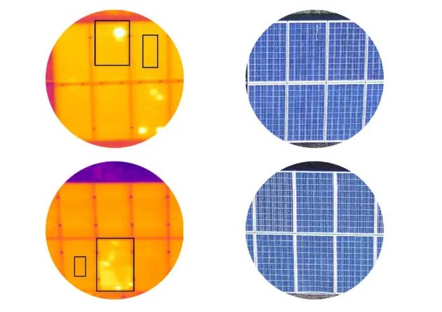
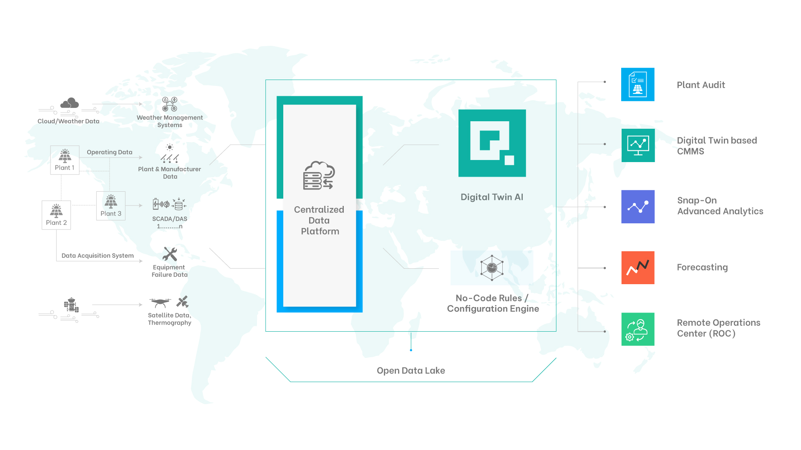

# Customer Summary

## List of Companies

- Above
- Bluence
- Coperniq
- DroneDeploy
- Energy Toolbase Software
- Fluence$
- Jobflo
- Next Era 360
- Next Wave Energy Monitoring (No Data yet)
- Quadrical AI
- RaptorMaps
- SenseHawk
- Smarttrac
- TeraBase
- Zeitview
---

## Small Companies

| Company           | Relative Size     | Target Customer       | Digital Twin      | Mobile Field App      | AI Features    | Primary Function     | 
|:------------------|:------------------|:----------------------|:------------------|:----------------------|:---------------|:---------------------|
| **Above**         | Smaller           | EPC | NO, Partners with DroneDeploy and others | YES | YES | Site Mapping, Captures overhead site inspection and field testing data from intital construciton to operations |
| **Coperniq**      | Smaller           | Residential and Commercial; EPC | N/A | N/A | N/A | Asset performance monitoring and energy trading |
| **JobFlo**        | Smaller           | Residential EPC | N/A | N/A | N/A | CRM for Residential Installations |
| **Quadrical**  | Smaller           | O&M; IP | YES | N/A | N/A | Side Monitoring via digital twin |
| **Smarttrac**     | Smaller           | Asset Owners | YES (3D) integrates drone imagery | N/A | Real time anomoly detection using inverter data and propretary Physics Informed Neural Networks (PINN) | Digital Twin and AI Software (LLM) for Energy forecasting and fault prediction. Focused primarily on tracker maonitoring |

## Medium-sized Companies

| Company           | Relative Size     | Target Customer       | Digital Twin      | Mobile Field App      | AI Features    | Primary Function     | 
|:------------------|:------------------|:----------------------|:------------------|:----------------------|:---------------|:---------------------|
| **DroneDeploy**   | Medium            | Construction Companies (not solar specific) | YES | N/A | N/A | Drone Site mapping to Digital Twin |
| **Energy Toolbase Software** | Medium | Targeted Primarily at C&I rooftop | YES | NO | N/A | SCADA/Monitoring Solution across solar and storage. Solutions from site design, to monitoring, to control (SCADA) |
| **Next Era 360**  | Medium software team (200) within larg firm (12B) | C&I, Muni Utilities, CCA's | N/A | N/A | YES, for demand response planning from meter data | Solar Site Analytics |
| **RaptorMaps**    | Medium | EPC and Asset Owners | YES | YES, VR as well | YES, uses SCADA data and Inverter heat map trends to send maintenace alters to asset owners and field app | Started with Drone Site Mapping, now expandign to robot inspection and maintenance tasking (in competition with OnSight) |
| **SenseHawk**     | Medium | EPC | YES | YES | N/A | Construction Management through QC |

## Large Companies 

| Company           | Relative Size     | Target Customer       | Digital Twin      | Mobile Field App      | AI Features    | Primary Function     | 
|:------------------|:------------------|:----------------------|:------------------|:----------------------|:---------------|:---------------------|
| **Bluence**       | Large             | Asset Owners          | N/A | N/A | Uses AI to optimize asset management by monitoring massive amount of data and signals | Asset performance monitoringand energy trading |
| **Fluence**       | Large             | Asset Owners | N/A | N/A | N/A | Software and O&M Services |
| **TeraBase**      | Large             | EPC | YES | YES, all QC variances are noted during construction (via overhead imagery, or potentially from OnSight robots) are sent to field inspectors via app. Inspectors can take images, note issues, and tag data directly into digital twin | YES, (mostly machine vision to process and tag drone imagery then note variances between design and as-built digital twin) | Design and Deployment Monitoring System |

## Short Summary on each Company  

### Above  
**Comment:**  
"Met with Peregrine Fraser (CCO) and Daniel Mello Guimaraes (US Sales Manager). Site Mapping & Digital Twin integration recommended by OnSight. Have tried to work on OnSight inspection data but their contract was with Ryan (former COO). Willing to reengage with Staubli.  

**Personal Summary:**  
Aerial inspection done with drones (topographic mapping, construction monitoring, thermographic inspection). Thermographic inspection, just as OnSight but with a drone, maybe easier to implement than a robot on the floor. Thermographic inspection happens on a cellular level. Drone probably only flies over the solar plants and only checks front side of PV, meaning it doesn't record heat distribution of connectors. Above holds patents "that ensure their inspections give accurate and high-quality results". The patent is on the normalisation methodology which allows them to collect "most accurate" data. 
The data from the inspection is displayed on SolarGain, which is their interface (App), which provides different filters to track performance and other necessities.  
Quality assurance of the thermographic inspection is carried out by a level 1 thermographer to ISO 18436 standards which working with ISO 9001:2015 processes.  

**Personal Rating: 7/10**

**Thermographic Inspection from Above Drone**  

---

### Coperniq  
**Comment:**  
"Ycombinator backed startup - seems to be focused primarily on residential assets"  

**Personal Summary:**  
Eases the burden of running and surveiling multiple solar project in parallel. Focused on smaller solar power plants - good for Residents or overviewing multiple projects. Benefits of Coperniq is the decrease of the cost per watt (management gets more effective) and the increase in the referral rates contractors. Coperniq is used by solar, battery and other energy contractors and helps them transform their business - digitalization.  

**Personal Rating: 5/10**  

---

### JobFlo
**Comment:** -  
**Personal Summary:**  
JobFlo is a software platform focusing on Customer Relationship Management (CRM) and increasing efficiency of solar projects on a smaller scale (Residents). Jobflo can integrate other key software for individuals to manage, track and process their solar business.  

**Personal Rating: 4/10** 

---

### Quadrical AI  
**Comment:**  
Out of India. Deployed with Brookfield Energy. Typical sites are smaller (10MW). Logger collects data from SCADA (Supervisory Control and Data Acquisition) adn populates digital twin.  

**Personal Summary:**  
They promise an increase in performance of the solar power plants of 2-4% and a easy to use interface to manage a fast growing solar portfolio. From what I saw, their business is quiet similar to what we aim for with the sherpa project. The only thing that they don't really speak about in detail is how they get to the data and through what algorithms or DNN models they want to do predictive maintenance. Are they only getting inverter data? They call it "Operating Data" and "Data Acquisition System" on their website but don't go into further detail. The data process line is quiet similar (Centralized Datalake leveraging Cloud Solutions). Don't know if we want to go as far with the Digital Twin as they went but apart from that and the data acquisition pipeline and that their focus isn't laid on the connectors in the solar plant, there are a lot of similarities with our sherpa project.  

**Personal Rating: 8/10**

**Pipeline of Digital Service for Solar Plants**  

---

### Smarttrac  
**Comment:**  
"Seems to have some overlap with SmartHelio"  

**Personal Summary:**  
Smarttrak product combines energy forcasting, fault prediction, digital twin, remote management and drone integration. The forecasting happens through Deep Learning models and are considering the weather predictions. The fault prediction happens via PINN (Physics Informed Neural Networks) and it seems like they only feed inverter data into the model. For the digital twin they provide VR and AR solutions. The drone oversees the solar farm and can detect panel damage, prevent problems caused by soiling and vegetation. Their dashboard is supported by a LLM chatbot.

**Personal Rating: 7/10**

---

### DroneDeploy  
**Comment:** -  
**Personal Summary:**  
DroneDeploy is a company participating in several different industries: Construction, Oil & Gas, Renewable Energy, Agriculture, Mining & Quarries, Utilities, Roofing and Property Management. They provide users with an AI based plattform and software where they can analyze stored data. Their main products are aerial and ground inspection via drone and robot. They are not focused on the hardware of the drone, meaning their product is compatible with all world leading commercial drones. As for the inspection on the floor, they use a robot from BostonDynamics. Drone and Robot work with docking systems so that the can automatically recharge their batteries. One other thing I found interesting was, that they also sell "Safety AI". This will monitor the site and and detect any safety risks found, which safety workers then can get rid off, for example cables laying around a staircase.  
All over the solutions DroneDeploy offer seems pretty general, meaning it can be used for many different sites. For example also for tracking process on a construction site, I think that is where they came from. Their Drone product seems to be the main product.  
They sell their product via monthly subscription, probably the robots would be leased and for the drone you could just use your own, or as well lease one and that would also go for the docking station.  

**Personal Rating: 8/10**

---

### Energy Toolbase  
**Comment:**  
"Potential partner for OnSight owl. " 

**Personal Summary:**  
Energy Toolbase is a insdustry software platform that offers project modeling, energy storage control, and asset monitoring products for solar and storage developers. Their business consists of four different core products. The ETB Developer, which models precise financial analysis for solar and it's storage. The ETB Controller which leverages AI and the forecasting of energy production and the energy cost to maximize the economic gain from the solar farm and the battery storage unit. The ETB Monitor, monitors the solar and the storage asset in real-time. And the last product is the ETB Consulting, where the analysis of the solar and storage asset can be outsourced to the experts of Energy Toolbase.  
The whole company seems, at least for me, more focused towards the financial side of a solar plant. They can help asset owners to maximize their outcome of a solar farm. But when it comes to more technical aspects of monitoring a solar farm like preventive maintenance or using new technology in areas where it could really make a difference, there they haven't got a solution nor expertise. I mean the automation of trading the energy between in-house use, storing it in the storage or selling it on the market is nice but it's in my opinion nothing groundbreaking.  

**Personal Rating: 7/10**

---

### Next Era 360  
**Comment:**  
"DERMS - Destributed Energy Response Management System. Internal tools developed for NextEra's use made available for smaller utilities."  

**Personal Summary:**  
The customers of Next Era 360 are businesses which are getting help on their journey of decarbonization. They structured their product between those three niches: Visualize, Realize and Maximize. Their big selling point is their expertise in renewable energies (sun and wind), where they are the leader with over 180 billion in total assets. Through that they can analyze approximately 560 billion data points daily, which gives them a good advantage data-wise. Part of the Visualize package is: Connect data across different assets of your portfolio, track and report energy usage, carbon emissions, forecast net demand and aggregate energy bills and identify opportunities to change tariffs. The Realize package is about the optimization of asset performance (Optimization & Maintenance), reduce consumption and carbon emission and evaluate investments and their energy generation via simulation software. They promise a increase in performance of 1-3%. Their Maximize package is all about maximizing the financial gain from the energy plants. It automates energy trading using day-ahead and real-time algorithmic trading strategies, leverages smart dispatch models to capture arbitrage and incremental value. All of this reduces cost and drives profit.  

**Personal Rating: 8/10**

---

### RaptorMaps  
**Comment:**  
"Developing one stop solution - thus upsetting former partners like OnSight."  

**Personal Summary:**  
RaptorMaps offers the software and the platform for a digital twin of the customers solar plant. The data which they gather is collected by drone and probably also by reading the inverter data, which I'm not completely sure about because they don't really talk about that on their website. They offer all inclusive Raptor Solar Inspection, meaning they check for equipment health, balance of system components, vegetation and fire risks, cracks and module defects, tracker misalignment, grid interconnection poles, substations, security and perimeter checks, erosion and stormwater pollution, storm damage and construction verification. All of this they want to discover with sensor or cameras mounted to that surveillance drone. As far as I can tell those sensors only consists of a thermal camera and a normal camera, so they collect the thermal and the normal imagery of the plant. The drone flies it's route autonomously and then lands and recharges again on the docking station. They probably don't produce their own drone but it's not specifically said on the website. They don't really talk about the methodology of their different danger detection algorithms or deep learning models, I add that here because that would be central to know for me if I'd be interested in such a solution. Because from a machine learning side, a prediction is only as good as the data on which the model was trained on, and in my opinion it could be pretty hard to train a model being able to detect such a variety of possible danger, because there are pretty much endless possibilities of errors. Probably they just take the "correct" state of a plant and then just give a maximum tolerable deviation from that, and the rest needs to be checked. Anyways for me to analyze their product in more depth I would have to know how they tackle those difficulties.  

**Personal Rating: 8/10 - if the ML part is done properly then good product, shit website**

---

### Sense Hawk  
**Comment:**  
"100+GW in 600 sites so far in 20 countries."  

**Personal Summary:**  
SenseHawk combines all of their products in an easy to use platform. They do efficient construction management, quality control, automated punch list, monitoring and defect resolution and streamline development workflows. It is an all in one product which helps solar asset owners to digitalize their plants and increase the efficiency and decrease the cost of running the plant. They don't state specifically how they gather their data besides the imagery and the thermal cameras on the drone, but probably they also read inverter data. The product seems quiet similar to the one of RaptorMaps though there weren't any information about the drone hardware, does it come with a docking station, are the flights fully automated, and so on. Still I have the better impression about SenseHawk than RaptorMaps.  

**Personal Rating: 9/10**

---

### Bluence  
**Comment:**  
"Integrates with SCADA system and Power Plant controllers."  

**Personal Summary:**  
Bluence APM (Application Performance Monitoring) is a Software as a Service platform for management of renewable energy plant assets. They ensure data quality through monitoring the data and detecting five types of errors: frozen data, out-of-range values, data gaps, poor-quality at the source and meter resets. Next they put together an automatic loss detection and categorization plan, where you can see an overview and in-depth analysis of the losses identified by the system. It also classifies the losses and prioritize an action plan to reduce those losses. It also does predictive maintenance, using large datasets to uncover patterns in the data and find anomalies so that proactively technicians can solve the potential problem. At last it creates daily and monthly customizable reports, which increase efficiency even further so and they give also the opportunity to download the data captured by them. They also offer a solution where you can participate in Energy Market Trading. Bluence isn't telling on their website how they gather the data about those plants that they supervise. It sounds as if they aren't just getting the inverter data, but that is just an assumption from my side. It would be really interesting to know how they would gather that data. Maybe also interesting, they monitor 170+ GW of renewable power plants worldwide.  

**Personal Rating: 9/10**

---

### Fluence  
**Comment:**  
""Aquired by Siemens""  

**Personal Summary:**  
Fluence products focus on energy storage, services, APM and energy trading. Next to wind and solar they also play a role in hydro. They sell energy storage products in different "Stack" sizes, reaching from Gridstack to Ultrastack and also a solution specified for solar farms, the Sunstack. Their service solution is all about maximizing system performance and reliablity over the lifetime of the asset. They do preventive and also active maintenance. The APM from Fluence maximizes the value of the plant and increases annual profitability of 3-10%. Their approach to APM is pretty much the same as the one from Bluence. Next to that they also increase their customers ROI via automated bidding software, which is labeled as an AI solution. On their website they say that they could get an increased revenue from renewables of up to 10%, and even up to 50% increase in revenue from energy storage. For me it looks like their focus lies on their energy storage products.

**Personal Rating: 8/10**

---

### TeraBase  
**Comment:**  
"OnSight knows them well. Total software solution for EPC companies from sight simulation to as build digital twin with in process QC monitoring and reporting via mobile app."  

**Personal Summary:**  
They offer a complete software solution which guides the solar plant owner from planning the plant, with pre construction optimization, to construction management and quality control, to SCADA as soon the plant is up and running. SCADA includes plant control, EMS (Energy Managemetn System), IT & Cybersecurity solutions. The big difference to the others here is that TeraBase even helps constructing and designing the solar plant before it even exists. They have different software, one for predicting the future energy output of the potential solar plant, one for designing and optimizing the plant, one for simplifying complex earthwork assessment, so engineering hours can be cut drastically, and one to calculate the optimal string length for maximum energy output and reducing cost. In my opinion TeraBase has convinced me the most, even though they don't speak about how they are collecting the necessary data (as pretty much every larger firm in that list), still it seems like they got an all in one package and they got the experience which worths a lot.

**Personal Rating: 9/10**

---