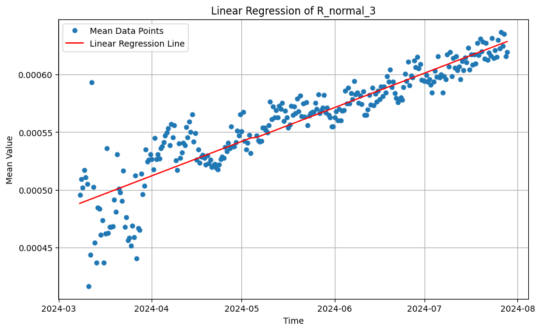

# Feasibility Study
We conducted this feasibility study to determine if the data collected from 07.03.2024 to 12.10.2024 was sufficient to provide a qualitative prediction of how the MC4 Connectors equipped with Exoskeletons will behave in the long and short term.

## Abstract
The amount and duration of data collection are not sufficient to make long-term predictions about the trend or seasonal effects. With only six months of data, we could make a sensible forecast for roughly 30 to 40 days. To understand the seasonal effects, we would need to run the experiments for at least one year. This would allow us to capture a complete period of seasonal effects, which is the bare minimum for this consideration.  
For the long-term trend, the results we obtained using different forecasting approaches show no consistent tendency. The year in which the maximum resistance of 2.6 mΩ is predicted to be exceeded, varies from 2025, as forecasted with a Polynomial Regression of the third degree, to 2030, as forecasted with both a SARIMA model and Linear Regression.  
Combining the lack of consistency across different forecasting methods for long-term trend predictions with the expertise of Stäubli Electrical Connectors on the change in resistance of an MC4 connector throughout its lifespan, we concluded that long-term predictions cannot be reliably made using only six months of data.  
One solution we propose is to install the Exoskeleton on different MC4 Connectors that have been operating in the field for varying lengths of time. Measuring MC4 connectors with different aging states could more effectively fill the gap in the missing data. With sufficient data on connectors at different stages of aging, we could use a Gaussian Process to forecast the missing intervals without measured data and display the long-term trend. 

---
## Results
### Linear Regression

### Polynomial Regression
**Second-Degree**

**Third-Degree**

### SARIMA Model
**Normal**  

**Crimp**  

**Cross-Mated**  

### Gaussian Process

**Summary Result**  
In the extended versions of the various graphs, it can be observed that the long-term trend is uncertain and cannot be determined with the measured data.
The Linear and Polynomial Regression graphs were created using only the measured data from the third "normal" connector, referred to as R_normal_3. However, there is no significant difference compared to the plots where I used the average of all the "normal" connectors. This is because I selected a connector with almost no outliers.  

One important distinction to consider is that, in the Gaussian Process, the light blue area does not represent the confidence interval but rather the calculated standard deviation of the predicted forecast. This is also why it scales differently compared to the confidence interval in the SARIMA model.  

The maximum resistance of 2.6 mΩ was chosen because, according to Stäubli EC internal documents, a voltage drop over a MULTILAM in the range of 26 mV to 50 mV is defined as "critical, unsure." However, it is important to consider that the voltage drop over the connectors also includes the contributions of 6 cm of cable (adding a total of 203 µΩ) and two crimps (adding approximately 140 µΩ) to the total resistance. The MULTILAM contributes only 80 µΩ to the total resistance but is the only part of the MC4 connector with a clear constraint on the tolerable maximum resistance. Therefore, the "Max Resistance" indicated in the plot is a very conservatively chosen boundary.  

All these factors would influence the plot by shifting it along the y-axis. However, this shift can largely be disregarded when focusing on the trend and seasonality of the forecast.

## Conclusion & Next Steps
The measured data points are insufficient to make a qualitative forecast extending beyond one month. We expected the "normal" connectors to converge in the early stages of their lifespan to a resistance value at which they would remain for most of their lifespan. However, this steady-state resistance level was not reached within the first six months, preventing us from predicting it.  

The effects of increasing resistance in the early stages of a connector's life can result from relaxation effects, contact oxidation, or other material-specific phenomena. Once this steady-state level of resistance is achieved, the connector remains at that level for a significant portion of its lifespan, until aging processes again cause the resistance to increase. Following a certain threshold of resistance increase due to aging, the connector exhibits an accelerated upward trend in resistance. This entire lifecycle typically spans approximately 30 years and can be approximated using a third-order polynomial curve.  

To accurately approximate when the maximum tolerable resistance is reached, we require core information about the connectors. Without such information, predicting the long-term behavior of the curve is largely unfeasible.  

We assume that we could approximate the curve more effectively if we had access to different MC4 connectors that had been in the field for varying lengths of time. By analyzing such connectors, we could extract the necessary core information to predict a realistic long-term trend and assess the impact of seasonality. The following image illustrates how this process could work:  

The next steps should focus on redeploying the Exoskeletons for data collection as soon as possible to gather data over a broader time period. Additionally, if resources permit, it would be crucial to measure MC4 connectors of different ages over a shorter period (a few months) to enable proper forecasting. This would provide meaningful insights into the long-term trend, seasonal effects, and potentially the approximate lifespan of MC4 connectors.

