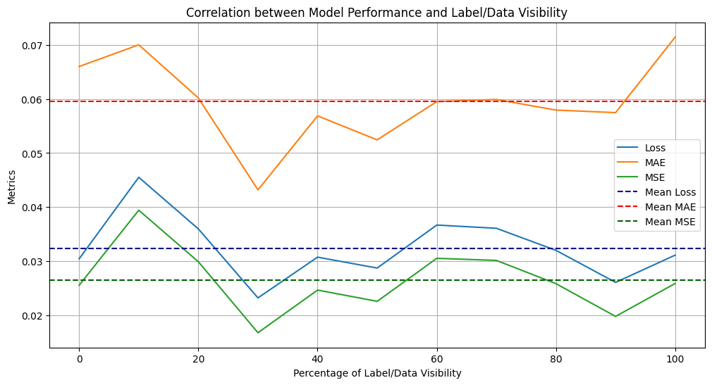

# **Model Modification Documentation**

## **Overview**
This document summarizes the results and insights I gained during the experiments on the Deep-Learning model in **Stable_Combined_Phase1_and_Phase2_model.ipynb** which is the latest model from SmartHelio, created for the Sherpa project.

---

## **Key Modifications**

1. **Preventing Overfitting**: Different training duration, small changes in LR or Dropout rate

2. **Hyperparameter Tuning**: Automated Hyperparameter tuning with Keras Tuner. Difference between BaysianOptimizer compared to RanomSearch. Show results and talk about why differences occur.

3. **Changes on the Model**: From learnings during HP tuning tried some changes on the model to see the results.  
Different Input data from weather (T_a), delta_T?, delta_t?  
Output only between normal and bad --> no real interest for customer why it is bad. (x,y,z) --> (x,y)  
New data preprocessing function added (subdatasets splitting happens on the batch level to assure even occurrance of different distribution between normal and bad in the different subdatasets.)  
New testing function: Testing metrics (mae and mse), visualizing throught testing subsubdatasets the difference in metrics depening on the percentage of labels and data masked. To achieve comparability between cases where 80% is dropped to ex. where only 20% is dropped, how does it affect the error metics. Created comparable benchmarks throught this. (Makes future models comparable)  

4. **Next Steps**: Trying out different (smaller) STEPSIZE, which is 144 rn (half a day). Seeing effects on the metrics when it gets decreased.  
Different model 1 (XGBOOST), still trained on givin a 3 dimensional output. Maybe try out ConvXGBOOST when we have to train it anyways.  
Find a sol how to get our hands on as much more data as possible.  

---

## **Experiments**

**Try 1:**
| Hyperparameter        |  Value     |      
|-----------------------|------------|
| **L1 Regularization** | 0.01       |
| **L2 Regularization** | 0.1        |
| **Batch size**        | 64         |
| **Dropout Rate**      | 0.1        |
| **Dense Units**       | 512        |
| **LSTM units**        | 128        |
| **Activation**        | relu       |
| **Pool Size**         | 4          |
| **Learning Rate**     | 0.0001     |

**Model Information:**
|                           |     Value        |
|---------------------------|------------------|
|**Optimizer**              | BaysianOptimizer |
|**Trials**                 | 150              |
|**Epochs per trial**       | 8                |
|**Execution per trial**    | 2                |
|**Stepsize Masking**       | 20%              |
|**Output Dimension**       | 3                |

 

**Best reached MAE during HP Tuning**
| Metric                    |   Value          |
|---------------------------|------------------|
| Mean Average Error (MAE)  | 0.06             |

**Result on Test Dataset (Batch4):**
| Metric                    |   Value          |
|---------------------------|------------------|
| Mean Average Error (MAE)  | 0.137            |
| Mean Squared Error (MSE)  | 0.02824          |
| Loss                      | 2.662            |

--------------------------------------------------------------------------------

**Try 2:**
| Hyperparameter        |  Value     |      
|-----------------------|------------|
| **Number of layers**  | 3          |
| **L1 Regularization** | 0.01       |
| **L2 Regularization** | 0.0001     |
| **Batch size**        | 256        |
| **Dropout Rate**      | 0.1        |
| **Dense Units**       | 256        |
| **LSTM units**        | 128        |
| **Activation**        | sigmoid    |
| **Learning Rate**     | 0.0001     |
| **Optimizer**         | RMS        |

**Model Information:**
|                           |     Value        |
|---------------------------|------------------|
|**Optimizer**              | BaysianOptimizer |
|**Trials**                 | 150              |
|**Epochs per trial**       | 8                |
|**Execution per trial**    | 2                |
|**Stepsize Masking**       | 20%              |
|**Output Dimension**       | 3                |

 

**Best MAE reached during HP Tuning**
| Metric                    |   Value          |
|---------------------------|------------------|
| Mean Average Error (MAE)  | 0.05489          |

**Result on Test Dataset (Batch4):**
| Metric                    |   Value          |
|---------------------------|------------------|
| Mean Average Error (MAE)  | 0.1155           |
| Mean Squared Error (MSE)  | 0.0186           |
| Loss                      | 1.366            |

**Changes from Try 1 to Try 2:**  
Pool Size has been dropped as a Hyperparameter due to too little influence.  
Optimizer has been added as a Hyperparameter the choice was set between Adam and RMS.

-------------------------------------------------------------------------------

**Try 3:**
| Hyperparameter        |  Value     |      
|-----------------------|------------|
| **Number of layers**  | 2          |
| **L1 Regularization** | 0.01       |
| **L2 Regularization** | 0.0001     |
| **Batch size**        | 64         |
| **Dropout Rate**      | 0.1        |
| **Dense Units**       | 256        |
| **LSTM units**        | 128        |
| **Activation**        | relu       |
| **Learning Rate**     | 0.0001     |
| **Optimizer**         | RMS        |

**Model Information:**
|                           |     Value        |
|---------------------------|------------------|
|**Optimizer**              | RandomSearch     |
|**Trials**                 | 150              |
|**Epochs per trial**       | 8                |
|**Execution per trial**    | 2                |
|**Stepsize Masking**       | 20%              |
|**Output Dimension**       | 3                |

 

**Best MAE reached during HP Tuning**
| Metric                    |   Value          |
|---------------------------|------------------|
| Mean Average Error (MAE)  | 0.0577           |

**Result on Test Dataset (Batch4)**
| Metric                    |   Value          |
|---------------------------|------------------|
| Mean Average Error (MAE)  | 0.1232           |
| Mean Squared Error (MSE)  | 0.0210           |
| Loss                      | 1.369            |

--------------------------------------------------------------------------------

**Try 4:**
| Hyperparameter        |  Value     |      
|-----------------------|------------|
| **Number of layers**  | 3          |
| **L1 Regularization** | 0.0001     |
| **L2 Regularization** | 0.0001     |
| **Batch size**        | 64         |
| **Dropout Rate**      | 0.1        |
| **Dense Units**       | 192        |
| **LSTM units**        | 128        |
| **Activation**        | sigmoid    |
| **Optimizer**         | RMS        |

**Model Information:**
|                           |     Value        |
|---------------------------|------------------|
|**Optimizer**              | BaysianOptimizer |
|**Trials**                 | 60               |
|**Epochs per trial**       | 60               |
|**Execution per trial**    | 1                |
|**Stepsize Masking**       | 20%              |
|**Output Dimension**       | 3                |

 

**Best MAE reached during HP Tuning**
| Metric                    |   Value          |
|---------------------------|------------------|
| Mean Average Error (MAE)  | 0.05489          |

**Result on Test Dataset (Batch4)**
| Metric                    |   Value          |
|---------------------------|------------------|
| Mean Average Error (MAE)  | 0.0123           |
| Mean Squared Error (MSE)  | 0.0206           |
| Loss                      | 0.0333           |

**Changes from Try 3 to Try 4:**  
Learningrate was taken out as a HP and set to 0.0001 because this seemd as the best result in every Experiment.  
Numbers of epochs changed from 8 to 60 for HP Tuning, due to overfitting during training sessions.  
Lowered the number of training epochs to 60.

---------------------------------------------------------------------------------

**Try 5:**
| Hyperparameter        | Value      |      
|-----------------------|------------|
| **Number of layers**  | 2          |
| **L1 Regularization** | 0.0001     |
| **L2 Regularization** | 0.0001     |
| **Batch size**        | 64         |
| **Dropout Rate**      | 0.1        |
| **Dense Units**       | 256        |
| **LSTM units**        | 256        |
| **Activation**        | sigmoid    |
| **Optimizer**         | RMS        |

**Model Information:**
|                           |     Value        |
|---------------------------|------------------|
|**Optimizer**              | BaysianOptimizer |
|**Trials**                 | 45               |
|**Epochs per trial**       | 60               |
|**Execution per trial**    | 1                |
|**Stepsize Masking**       | 20%              |
|**Output Dimension**       | 3                |

 

**Best MAE reached during HP Tuning**
| Metric                    |   Value          |
|---------------------------|------------------|
| Mean Average Error (MAE)  | 0.0216           |

**Result on Test Dataset**
| Metric                    |   Value          |
|---------------------------|------------------|
| Mean Average Error (MAE)  | 0.0486           |
| Mean Squared Error (MSE)  | 0.0164           |
| Loss                      | 0.0656           |

**Changes from Try 4 to Try 5:**  
For this try I changed the output dimension of the model from 3 to 2, meaning the model only distinguish between normal (0) and bad (1), where the bad label is the combination of the bad crimped and cross mated class.  
Next to that I changed the level where the data is split into subdatasets. Before it was done after combining all of the batches together. Now it is done batchwise to ensure that the different combinations of sensortypes are represented evenly.

---------------------------------------------------------------------------------

**Try 6:**
| Hyperparameter        |  Value     |      
|-----------------------|------------|
| **Number of layers**  | 3          |
| **L1 Regularization** | 0.0001     |
| **L2 Regularization** | 0.0001     |
| **Batch size**        | 256        |
| **Dropout Rate**      | 0.1        |
| **Dense Units**       | 256        |
| **LSTM units**        | 192        |
| **Activation**        | sigmoid    |
| **Optimizer**         | RMS        |

**Model Information:**
|                           |     Value        |
|---------------------------|------------------|
|**Optimizer**              | BaysianOptimizer |
|**Trials**                 | 60               |
|**Epochs per trial**       | 60               |
|**Execution per trial**    | 1                |
|**Stepsize Masking**       | 10%              |
|**Output Dimension**       | 2                |

 

**Best MAE reached during HP Tuning**
| Metric                    |   Value          |
|---------------------------|------------------|
| Mean Average Error (MAE)  | 0.01309          |

**Result on Test Dataset**
| Metric                    |   Value          |
|---------------------------|------------------|
| Mean Average Error (MAE)  | 0.0469           |
| Mean Squared Error (MSE)  | 0.0122           |
| Loss                      | 0.1000           |

**Changes from Try 5 to Try 6:**  
Stepsize of the percentage which get dropped in the data preprocessing got halved to 10% to increase variability.  
Testdataset is split into further subdatasets which are dependent on the percentage of covered labels/data.  
This new evaluation method should reveal the correlation between the numbers of monitored connectors and the accurary of the models prediction.  

-----------------------------------------------------------------------------------

**Try 7:**
| Hyperparameter        | Value      |      
|-----------------------|------------|
| **Number of layers**  | 2          |
| **L1 Regularization** | 0.0001     |
| **L2 Regularization** | 0.001      |
| **Batch size**        | 64         |
| **Dropout Rate**      | 0.1        |
| **Dense Units**       | 256        |
| **LSTM units**        | 128        |
| **Activation**        | sigmoid    |
| **Optimizer**         | Adam       |

**Model Information:**
|                           |     Value        |
|---------------------------|------------------|
|**Optimizer**              | BaysianOptimizer |
|**Trials**                 | 60               |
|**Epochs per trial**       | 60               |
|**Execution per trial**    | 1                |
|**Stepsize Masking**       | 10%              |
|**Output Dimension**       | 2                |

**Best MAE reached during HP Tuning**
| Metric                    |   Value          |
|---------------------------|------------------|
| Mean Average Error (MAE)  | 0.0185           |

**Evaluated with Hyperparameters on Testdataset:**
| Metric                    |   Value          |
|---------------------------|------------------|
| Mean Average Error (MAE)  | 0.03513          |
| Mean Squared Error (MSE)  | 0.02407          |
| Loss                      | 0.0347           |

---------------------------------------------------------------------------------

**Try 8:**
| Hyperparameter        |  Value     |      
|-----------------------|------------|
| **Number of layers**  | 2          |
| **L1 Regularization** | 0.0001     |
| **L2 Regularization** | 0.001      |
| **Batch size**        | 64         |
| **Dropout Rate**      | 0.1        |
| **Dense Units**       | 256        |
| **LSTM units**        | 128        |
| **Activation**        | sigmoid    |
| **Optimizer**         | Adam       |

**Model Information:**
|                           |     Value        |
|---------------------------|------------------|
|**Optimizer**              | BaysianOptimizer |
|**Trials**                 | 60               |
|**Epochs per trial**       | 60               |
|**Execution per trial**    | 1                |
|**Stepsize Masking**       | 10%              |
|**Output Dimension**       | 2                |
|**Permutation**            | 10               |

**Best MAE reached during HP Tuning**
| Metric                    |   Value          |
|---------------------------|------------------|
| Mean Average Error (MAE)  | 0.0185           |

**Evaluated with Hyperparameters on Testdataset:**
| Metric                    |   Value          |
|---------------------------|------------------|
| Mean Average Error (MAE)  | 0.0196           |
| Mean Squared Error (MSE)  | 0.0062           |
| Loss                      | 0.013            |

**Changes from Try 7 to Try 8:**  
Permutation changed from default value 5 to 10.

------------------------------------------------------------------------------------

**Try 9:**
| Hyperparameter        | Value      |      
|-----------------------|------------|
| **Number of layers**  | 2          |
| **L1 Regularization** | 0.0001     |
| **L2 Regularization** | 0.001      |
| **Batch size**        | 512        |
| **Dropout Rate**      | 0.1        |
| **Dense Units**       | 256        |
| **LSTM units**        | 128        |
| **Activation**        | sigmoid    |
| **Optimizer**         | Adam       |

**Model Information:**
|                           |     Value        |
|---------------------------|------------------|
|**Optimizer**              | BaysianOptimizer |
|**Trials**                 | 60               |
|**Epochs per trial**       | 60               |
|**Execution per trial**    | 1                |
|**Stepsize Masking**       | 10%              |
|**Output Dimension**       | 2                |
|**Permutation**            | 10               |
|**TIMESTEP**               | 12               |

**Best MAE reached during HP Tuning**
| Metric                    |   Value          |
|---------------------------|------------------|
| Mean Average Error (MAE)  | 0.0185           |

**Evaluated with Hyperparameters on Testdataset:**
| Metric                    |   Value          |
|---------------------------|------------------|
| Mean Average Error (MAE)  | 0.335            |
| Mean Squared Error (MSE)  | 0.188            |
| Loss                      | 0.194            |

**Changes from Try 8 to Try 9:**  
Constant TIMESTEPS was changed from 144 to 12, meaning the size of the samples was decreased from half a day to 1 hour.

**Hypothesis**
It seems like the perfomance of the model is closely coupled to the size of the sample, meaning if the size is decreased from 12h to 1h the performance drop is large (MAE(12h): 1.96%, MAE(1h): 33.5%). This shows that the model is dependent on multiple datapoints in time to give an accurate prediction about the state of the connectors and their composition.  
We think that this difference in the models performance comes from a too high in class variance.

--------------------------------------------------------------------------------

**Try 10:**
| Hyperparameter        | Value      |      
|-----------------------|------------|
| **Number of layers**  | 2          |
| **L1 Regularization** | 0.0001     |
| **L2 Regularization** | 0.001      |
| **Batch size**        | 256        |
| **Dropout Rate**      | 0.1        |
| **Dense Units**       | 256        |
| **LSTM units**        | 128        |
| **Activation**        | sigmoid    |
| **Optimizer**         | Adam       |

**Model Information:**
|                           |     Value        |
|---------------------------|------------------|
|**Optimizer**              | BaysianOptimizer |
|**Trials**                 | 60               |
|**Epochs per trial**       | 60               |
|**Execution per trial**    | 1                |
|**Stepsize Masking**       | 10%              |
|**Output Dimension**       | 2                |
|**Permutation**            | 10               |
|**TIMESTEP**               | 72               |

**Best MAE reached during HP Tuning**
| Metric                    |   Value          |
|---------------------------|------------------|
| Mean Average Error (MAE)  | 0.0185           |

**Evaluated with Hyperparameters on Testdataset:**
| Metric                    |   Value          |
|---------------------------|------------------|
| Mean Average Error (MAE)  | 0.0595           |
| Mean Squared Error (MSE)  | 0.026            |
| Loss                      | 0.032            |

**Changes from Try 9 to Try 10:**  
Constant TIMESTEPS was changed from 12 to 72, meaning the size of the samples was increased from 1h to 6h.

------------------------------------------------------------------------------------------------------------

## **Challenges**

- Model tends to overfit the given composition of the normal and bad connectors.
- No real Benchmark/Goal defined for the model.
- Big fluctuation of the val_mae in the training sessions.
- Normal Connectors show an increase in resistance of around 20% over the first half year.
- Cross-mated Connectors show an increase in resistance of around 100% over the first half year.
- Bad crimped Connectors show an increase in resistance of around 50% over the first half year.
- Not all seasonal differences included in the data yet.

---

## **Next Steps**:
- Trying different Stepsizes than 144 (half day).
- Trying higher permutation for the masked labels/data.
- Training XGBoost model for binary output.
- Switching XGBoost for ConvXGBoost. (Better perfomance on different datasets)
- Including a Timestamp to Connectors and Sensors.
- Including delta_T of the connectors.
- Getting more meaningfull data (Different measurement location).
- Switching the number for the "unknown" label, -1 can occur in the data for ex. as the Temperature.

---

We have to take into consideration that in those forecasting results the resistance of ~6cm cable are included, which contributes 253µΩ of the initial resistance.